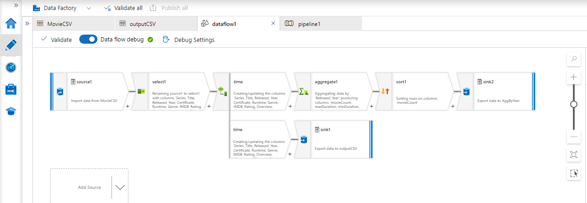

<h1>Movie Data Flow pipeline :</h1>
 
<h3>Data sets : </h3>
<li>1- Movie.csv</li>
<li>2- NewMovie.csv</li>
<li>3- AgByYear.csv</li>

<h3>Data Flow : </h3>
<li>1- select Flow </li>
<li>2.1- Extract New columns</li>
<li>        2.1.1- aggregate flow</li>
<li>        2.1.2- sort flow</li>
<li>        2.1.3- sink flow</li>
<li>2.2- Make copy branch flow</li>
<li>        2.2.1- sink flow</li>

 

